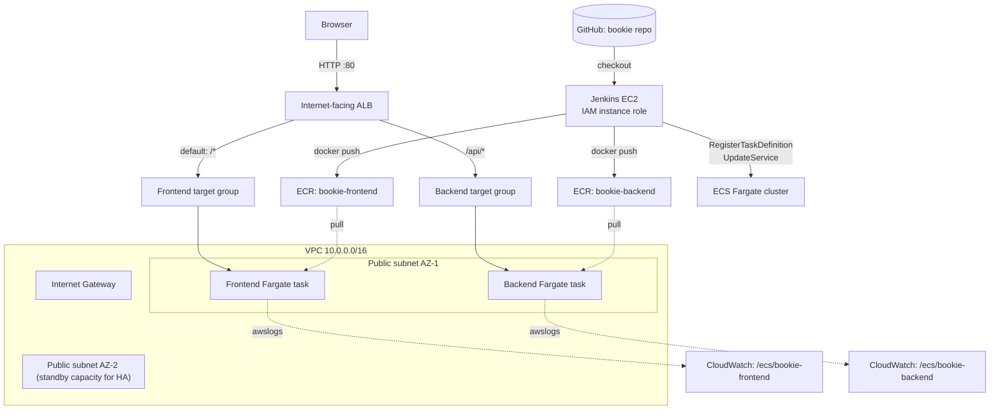

# Bookie

A React + Express application deployed as a full CI/CD platform on AWS:
Jenkins on EC2 builds and scans Docker images, pushes them to ECR, and
drives zero-downtime ECS Fargate deployments behind an Application Load
Balancer — all provisioned with Terraform.

The deployed frontend calls the deployed backend and displays **SUCCESS**
and a freshly generated GUID, proving the whole path (ALB → ECS → CloudWatch
→ back to the browser) works end to end.

## Project overview

- **Frontend**: React (Create React App), served by an unprivileged Nginx
  container. Fetches `GET /api/status` on load.
- **Backend**: Express, returns `{status: "SUCCESS", guid: <uuid>,
  timestamp}` from `GET /api/status`, plus `GET /api/health` for health
  checks.
- Both are same-origin in production: the ALB routes `/api/*` to the
  backend and everything else to the frontend, so the browser never has to
  deal with cross-origin requests.
- **Note on the starter repo**: the originally-specified starter
  (`pakurumo/techpathway-2`) does not exist (no such GitHub account). Per
  explicit direction, this app was built from scratch rather than forked.
  See `PROJECT_STATUS.md` for the full account of that decision.

## Architecture



Security groups (not shown above for clarity): the ALB security group is
the only one open to `0.0.0.0/0` (port 80). Frontend and backend task
security groups accept inbound traffic **only** from the ALB security
group — ECS tasks have public IPs (no NAT Gateway, by design, to avoid its
cost) but are never directly reachable from the internet. Jenkins has its
own security group (port 8080 restricted via `jenkins_allowed_cidrs`, SSH
closed by default in favor of SSM Session Manager).

## AWS resources

| Resource | Purpose |
|---|---|
| 1 VPC, 2 public subnets (2 AZs), IGW, public route table | Networking |
| Application Load Balancer + 2 target groups + listener/rule | Routing (path-based, same-origin) |
| ECS Fargate cluster + 2 services + 2 task definitions | Running the app |
| 2 ECR repositories (immutable tags, scan-on-push, lifecycle policy) | Image storage |
| Jenkins EC2 (t3.small, encrypted EBS, IMDSv2) + instance profile | CI/CD |
| IAM: ECS execution role, 2 minimal task roles, Jenkins pipeline role | Least-privilege access |
| 2 CloudWatch log groups (14-day retention) | Container logs |

No NAT Gateway, no ACM certificate/HTTPS, no WAF — all intentionally out of
scope to keep this cost-conscious (see "Estimated AWS costs" below).

## Security controls

Full list with file references in [SECURITY_CHECKLIST.md](SECURITY_CHECKLIST.md);
rationale and accepted risks in [docs/SECURITY.md](docs/SECURITY.md).
Highlights: least-privilege IAM, EC2 instance role (no static AWS
credentials anywhere), IMDSv2, encrypted EBS, ECR scan-on-push + immutable
tags, non-root + multi-stage + read-only-root-filesystem + all-capabilities-
dropped containers, restricted CORS, HTTP security headers, no direct
internet ingress to ECS tasks, ECS deployment circuit breaker + automatic
rollback (both infra-level and pipeline-level), gitleaks secret scanning,
Trivy container scanning, Dependabot, CODEOWNERS.

## Repository structure

```
bookie/
├── frontend/            React app (CRA) + Dockerfile + nginx.conf
├── backend/              Express app + Dockerfile
├── terraform/            Infrastructure as code
│   └── templates/        Jenkins EC2 user-data script
├── docs/                  Deployment/Jenkins/security/troubleshooting guides
├── Jenkinsfile            Declarative CI/CD pipeline
├── PROJECT_STATUS.md      Living status doc (start here if resuming work)
├── SECURITY_CHECKLIST.md
└── SECURITY.md
```

## Prerequisites

- Node.js 20 LTS, npm
- Docker
- Terraform >= 1.5.0
- AWS CLI v2, configured with credentials that can create VPC/ALB/ECS/ECR/
  IAM/EC2 resources
- (For Trivy/hadolint/gitleaks locally, optional but recommended):
  `brew install trivy hadolint gitleaks` on macOS

## Local testing instructions

```bash
# Backend
cd backend
npm install
npm test
npm start                     # listens on :8080

# Frontend (separate terminal)
cd frontend
npm install
npm test
npm start                     # listens on :3000, calls http://localhost:8080 directly in dev (.env.development)
```

Visit `http://localhost:3000` — it should show `SUCCESS` and a GUID within
a second.

## Docker instructions

```bash
docker build -t bookie-backend:local ./backend
docker build -t bookie-frontend:local ./frontend

docker network create bookie-net
docker run -d --name backend --network bookie-net -p 8080:8080 \
  -e CORS_ORIGIN=http://localhost:3000 bookie-backend:local
docker run -d --name frontend --network bookie-net -p 3000:8080 bookie-frontend:local

curl http://localhost:8080/api/status
curl http://localhost:3000/healthz
```

Both images run correctly with `--read-only --cap-drop ALL` (see
`docs/SECURITY.md` for the exact verification commands used).

## Terraform deployment instructions

See [docs/DEPLOYMENT.md](docs/DEPLOYMENT.md) for the full step-by-step
sequence (including the one-time initial image push needed after the very
first `apply`, since Terraform creates the ECS services/task definitions
but doesn't build or push any image itself).

Quick reference:

```bash
cd terraform
cp terraform.tfvars.example terraform.tfvars
terraform init
terraform fmt -check && terraform validate
terraform plan -out=tfplan
terraform apply tfplan
```

## Jenkins setup instructions

See [docs/JENKINS_SETUP.md](docs/JENKINS_SETUP.md): retrieving the initial
admin password via SSM Session Manager, required plugins, adding GitHub
credentials, and creating the pipeline job.

### Required Jenkins plugins

Git, Pipeline (workflow-aggregator), Credentials Binding, Pipeline: Stage
View — all included in the "Install suggested plugins" default set. No
Docker Pipeline / AWS Steps / Terraform plugins are needed; the
`Jenkinsfile` shells out to the CLIs installed on the instance directly.

### Private GitHub repository authentication

A Jenkins Credential (`github-bookie-credentials`, username + Personal
Access Token or SSH key) configured in **Manage Jenkins → Credentials**.
Never hardcoded in the `Jenkinsfile` or job config.

### The Jenkins IAM role

`terraform/iam.tf` → `aws_iam_role.jenkins`, attached to the EC2 instance
via `aws_iam_instance_profile.jenkins`. Grants exactly: ECR auth + push to
the two project repos, ECS describe/register/update scoped to this
project's cluster and services, `iam:PassRole` limited to the three ECS
roles with a `PassedToService` condition, and SSM Session Manager access.
No static AWS credentials are ever configured in Jenkins.

### Creating the pipeline job

**New Item → Pipeline**, definition *Pipeline script from SCM*, point it
at this repo's `main` branch and `Jenkinsfile`. Full steps in
`docs/JENKINS_SETUP.md`.

### Triggering a deployment

**Build Now** on the `bookie-deploy` job, or push to `main` if a GitHub
webhook is configured.

## Verifying ECS and ECR

```bash
aws ecs describe-services --region us-east-1 --cluster bookie-dev-cluster \
  --services bookie-dev-frontend bookie-dev-backend \
  --query 'services[].{name:serviceName,desired:desiredCount,running:runningCount,status:status}'

aws ecr describe-images --region us-east-1 --repository-name bookie-dev-backend \
  --query 'imageDetails[].imageTags' --output table
```

## Rollback process

Two layers, see `docs/DEPLOYMENT.md` "Rollback": the `Jenkinsfile` records
each service's task definition before deploying and restores it
automatically on pipeline failure; ECS's own deployment circuit breaker
provides a second, infrastructure-level safety net.

## Troubleshooting

See [docs/TROUBLESHOOTING.md](docs/TROUBLESHOOTING.md).

## Estimated AWS costs

Rough `us-east-1` on-demand estimates, running continuously for a month —
**stop/destroy resources when not actively grading to avoid ongoing cost**:

| Resource | Approx. monthly cost |
|---|---|
| ALB (base + ~1 LCU) | ~$18 |
| Jenkins EC2 (t3.small, on-demand) | ~$15 |
| Jenkins EBS (20 GiB gp3) | ~$1.60 |
| ECS Fargate: 2 tasks × 0.25 vCPU / 0.5 GB, 24/7 | ~$18 |
| ECR storage (a handful of images) | <$1 |
| CloudWatch Logs (14-day retention, low volume) | <$1 |
| Data transfer (light demo traffic) | <$1 |
| **Total** | **~$55–60/month** if left running continuously |

Running only during active development/grading and destroying afterward
(`terraform destroy`) brings this down to a few dollars for the whole
exercise. No NAT Gateway (~$32/mo saved), no WAF, no ACM/HTTPS costs.

## Cleanup instructions

```bash
cd terraform
terraform destroy
```

If it fails because an ECR repo has images, see the `aws ecr
batch-delete-image` snippet in `docs/DEPLOYMENT.md`.

## Branch protection (recommendation)

Not configured by Terraform (a GitHub repo setting, not AWS). Recommended
for `main`: require a pull request before merging, require the
`bookie-deploy` Jenkins pipeline (or equivalent) to pass, require review
from a CODEOWNERS reviewer, and disallow force-pushes.

## Known limitations

- **HTTP only** — no domain name was provided for this challenge, so the
  ALB listens on port 80 only, no ACM certificate/HTTPS. Adding it later
  needs a Route 53 hosted zone + ACM cert + a second (443) listener.
- **Single Jenkins instance, no HA** — acceptable for a demo/challenge;
  a production setup would use Jenkins on ECS/EKS or a managed CI service.
- **No remote Terraform backend** — state is local. Fine for a single
  operator; a team would want S3 + DynamoDB locking (noted in
  `terraform/versions.tf`).
- **Egress-all security groups, public IPs on ECS tasks** — deliberate
  cost/complexity trade-offs, documented with justification in
  `docs/SECURITY.md`.
- Jenkins is a single `t3.small` — adequate for this pipeline's build load,
  but a heavier build matrix would need a bigger instance or a Jenkins
  agent fleet.
